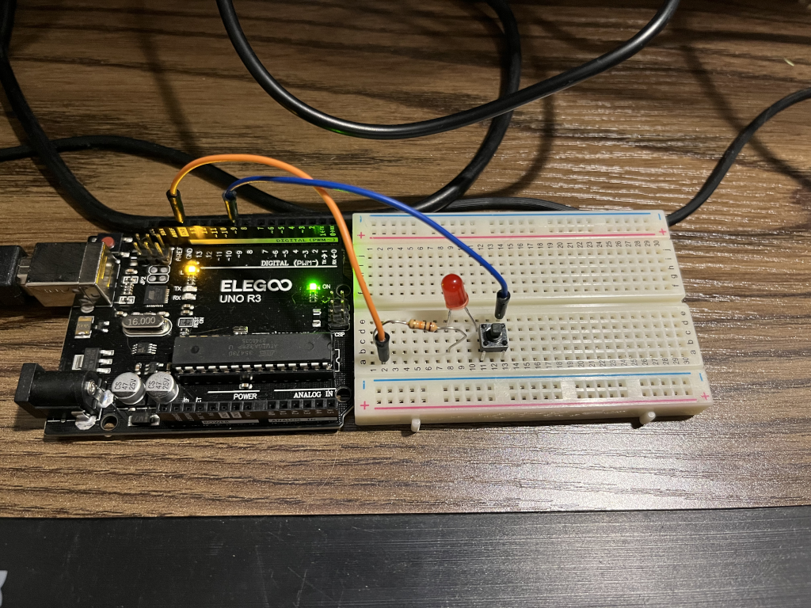
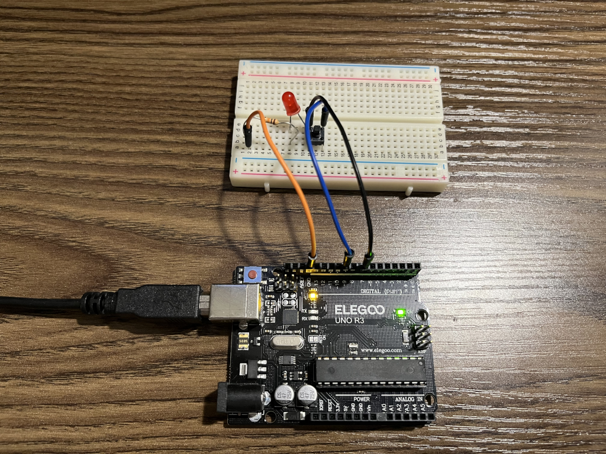
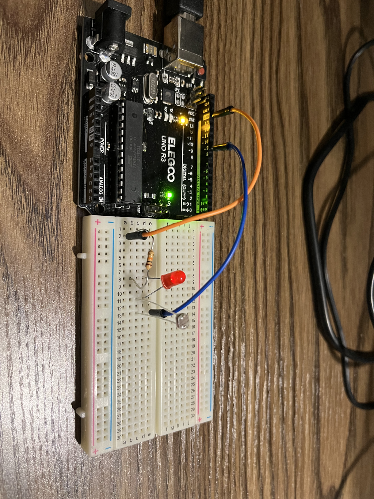

##### Pi is a fully fledged computer.
- Has a GPIO (General Purpose Input/Output) pins.
- Has a camera serial interface (CSI) and display serial interface (DSI), for touch display.
- Can use HaTs (Hardware Attached on Top) for additional functionality.
- ALSA (Advanced Linux Sound Architecture) for audio.
##### Arduino is a microcontroller
- [Blog](https://www.leorover.tech/post/raspberry-pi-or-arduino-when-to-choose-which)

##### purchased ardiuno starter kit [elegoo](https://www.amazon.com/dp/B01D8KOZF4?psc=1&smid=A2WWHQ25ENKVJ1&ref_=chk_typ_imgToDp)

240525
- set up arduino ide on windows 11, could not see the controller
- set up arduino ide on Raspian (couldn't make installer with kit work, used add /remove programs to pick up packages) and connected to pi
- completed blinking light project
- 

240526
- completed push button light project, with bread board, resistor, and push button.
- explored kit components.
- 

240601
- installed Raspberry 5
- updated software, installed arduino and vscode IDEs

240607
- attending [South East Linux Fest](https://southeastlinuxfest.org/self-2014-2/)
- Exploring home automation tools,
  -  [Script Server](https://github.com/bugy/script-server)
  - [VimWiki](https://vimwiki.github.io/vimwikiwiki/)
- AI suggested: such as [Home Assistant](https://www.home-assistant.io/), [OpenHAB](https://www.openhab.org/), and [Node-RED](https://nodered.org/) 

240622
- bought [magnifying glass headset](https://www.amazon.com/dp/B07T4KPYN2?psc=1&ref=ppx_yo2ov_dt_b_product_details)
- realized I had the LED in backwards, which is why it wouldn't work with the switch, only the onboard led was lighting up.
- updated code to get a better "debounce" state.

240630
- Created fade in / fade out for a pulsing LED.
-
- Explored positive / negative buses on breadboard. Not able to leverage them yet; using them instead of punching down right next to the resistor or LED lead didn't functino as expected.
- Combined LED and toggle as before. Now fades in and out when pressed, otherwise off.
- 
- substituted light sensor for push button
- 

240707
- Updated board and code to example 5-4, no real difference observed.
- Updated to 5-5, used serial monitor to observe values sent from LDR (light dependent resistor) sensor.
- Can't find the MOSFET (metal-oxide-semiconductor field-effect transistor) in kit, not listed in contents, nothing matches the drawings. Amazon to the rescue!
    [Assorted MOSFET Kit](https://www.amazon.com/BOJACK-IRFZ44N-IRF510N-transistors-Assortment/dp/B082J3F8HJ/ref=sr_1_3?crid=B436YM40HLT4&dib=eyJ2IjoiMSJ9.dKMSul7w2BlSv6jy3UPxJ5U3AVpk_PU86hDbPkIK49dwk_m1n2BmJiTSTLIL6GOBn95das7w9b6ULMhua2GNyyTgKjVP9EJVwPOy5WgAlXCmVNHLjZLeCofle5L_YDA-Bvvzpb_hlxTwejdq0cca22iZn9Wfm0j-rdUtu0OAROO5QuN6vLlSzeMjoH4VTPUu19peH4v1-VToUJNWXckjkBk3CEKegZnWGGWoCepWVQI.aCSWOzMTh9viigFywWUlyOSc9_wvS9xzQjQMglXBjPU&dib_tag=se&keywords=MOSFET&qid=1720371217&sprefix=mosfet%2Caps%2C156&sr=8-3)