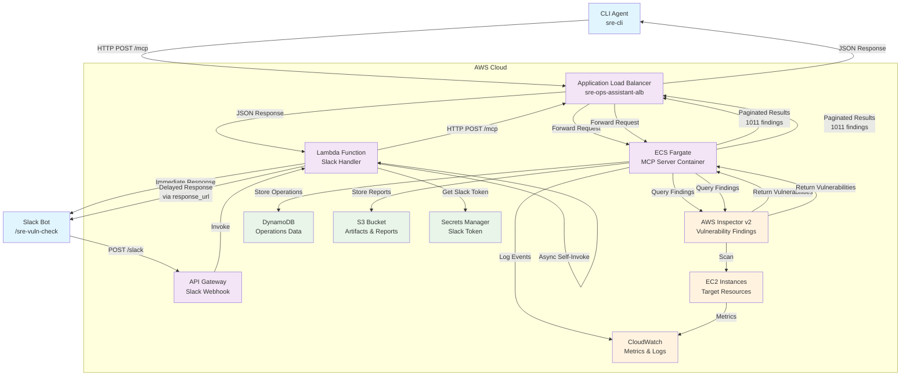

# SRE Operations Assistant - Data Flow Diagram

## System Architecture Overview



## Component Details

### 1. User Interfaces
- **CLI Agent**: Direct HTTP calls to ALB endpoint
- **Slack Bot**: Slash commands via API Gateway webhook

### 2. Request Flow

#### CLI Flow (Synchronous)
1. User runs `sre-cli vulnerabilities -i <instance-id>`
2. CLI sends HTTP POST to `http://sre-ops-assistant-alb.../mcp`
3. ALB forwards to ECS container (MCP Server)
4. MCP Server calls Inspector API with pagination
5. Returns complete vulnerability data (24 critical, 466 high, etc.)

#### Slack Flow (Asynchronous)
1. User types `/sre-vuln-check <instance-id>`
2. Slack sends POST to API Gateway `/slack` endpoint
3. Lambda returns immediate acknowledgment
4. Lambda invokes itself asynchronously
5. Async Lambda calls MCP Server via ALB
6. MCP Server processes vulnerability scan
7. Lambda sends delayed response to Slack via `response_url`

### 3. MCP Server Operations
- **Pagination**: Retrieves all Inspector findings (not just first 100)
- **Filtering**: Active findings only, by instance ID and severity
- **Response Format**: Standardized JSON with counts and summaries

### 4. AWS Services Integration
- **Inspector v2**: Source of vulnerability data
- **EC2**: Target instances for scanning
- **CloudWatch**: Logging and monitoring
- **DynamoDB**: Operations state storage
- **S3**: Report and artifact storage
- **Secrets Manager**: Secure token storage

## Key Technical Details

### Pagination Fix
```python
# Before: Only first 100 results
response = inspector.list_findings(maxResults=100)

# After: All results via pagination
while True:
    response = inspector.list_findings(**params)
    all_findings.extend(response.get('findings', []))
    if not response.get('nextToken'):
        break
```

### Slack Async Pattern
```python
# Immediate response (< 3 seconds)
return {'statusCode': 200, 'body': 'Processing...'}

# Async processing (up to 30 minutes)
lambda_client.invoke(
    FunctionName=context.function_name,
    InvocationType='Event',
    Payload=json.dumps(async_payload)
)
```

## Performance Metrics
- **CLI Response Time**: ~5-8 seconds for full scan
- **Slack Initial Response**: <2 seconds
- **Slack Delayed Response**: ~5-8 seconds
- **Data Volume**: 1011+ vulnerability findings per instance
- **Critical Findings**: 24 per target instance